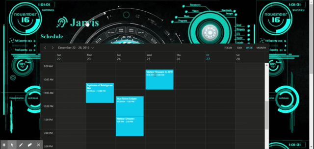
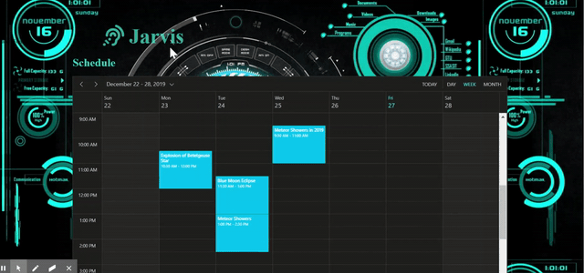

# JARVIS
The voice assistant for Syncfusion Component interactions

## Introduction:
Now we are in 2020 era, still if you are using touch or any other IO devices to make interaction with the web pages then surely, I will say you are outdated. Since the recent technology of voice assistance and its exponential growth, now the entire world (Computers, TV, washing machine, car and smart watch etc.,) is controlled and interacted with voice instead of hand work. 
This evolution reaches this much of booming with the help of Google, Amazon and Apple companies. Since they have introduced more successful voice assistance devices in the market.

## Our Scope:

In this project, we have taken the voice assistance support to interact with web components. Most of the time users will be tried to interact the component for frequent clicking, editing operations. So, we have implemented the voice assistance based on schema definition. This project will definitely useful for customers end who will evaluating our components and make more impress about our components and organization.
## Project Module:
In this project we have showcased the Schedule and Grid component and included the voice assistance support for this both components (like appointment window open, appointment creation, view navigation, date navigations, triggering events for Schedule component, cell selection, sorting, searching and grouping operation for Grid component.)
The main core for this project is schema definition for each component. In this schema definition we have defined the component actions, interaction and events and its corresponding method calls. Based on user voice input we have split the words and processed with the help of schema definition to predict the corresponding actions.
## Speech recognition
Speech recognition involves receiving speech through a device's microphone, which is then checked by a speech recognition service against a list of grammar (basically, the vocabulary you want to have recognized in a particular app.) When a word or phrase is successfully recognized, it is returned as a result (or list of results) as a text string, and further actions can be initiated as a result.
## Browser support
Support for Web Speech API speech recognition is currently limited to Chrome for Desktop and Android — Chrome has been supporting it with prefixed interfaces since around version 33, so you need to use prefixed versions of them, such as webkitSpeechRecognition.
Chrome support
As mentioned earlier, Chrome currently supports voice recognition with prefixed properties, so at the beginning of our code we include those lines to feed the right objects into Chrome, and any future implementations that could allow features without a prefix.
## How it works:
People nowadays use Echo and Google Home to interact with each other and do hands-free work. And this is an idea of what it would be like to be able to easily operate a complex web component such as Grid and Scheduler without touching the mouse / keyboard.
Schema for scheduler and grid:
<pre>
[
    {
        “control”: “schedule”,
        “actions”: [
            “navigate”,
            “go”,
            “move”,
            “switch”,
            “add”,
            “create”,
            “new”,
            “open”,
            “show”,
            “list”,
            “click”,
            “select”,
            “refersh”,
            “rerender”,
            “ orkweek g”
        ],
        “reducers”: {
            “navigate_go_switch_move”: {
                “action”: “navigate”,
                “view”: [
                    “week”,
                    “ orkweek”,
                    “month”,
                    “agenda”,
                    “day”
                ],
                “date”: [
                    “previous”,
                    “next”,
                    “today”
                ]
            },
            “open_click_select”: {
                “action”: “windowOpen”
            },
            “refresh_refreshing_rerender”: {
                “action”: “refresh”
            },
            “create_add_new”: {
                “action”: “addEvent”
            },
            “show_list”: {
                “action”: “showEvent”
            }
        }
    },
    {
        “control”: “grid”,
        “actions”: [
            “go to”,
            “sort”,
            “group”,
            “filter”,
            “short”,
            “edit”,
            “select”,
            “navigate”,
            “search”,
            “ungroup”
        ],
        “reducers”: {
            “navigate_go_to”: {
                “action”: “paging”
            },
            “sort”: {
                “action”: “sorting”
            },
           	“select_click”: {
                “action”: “selection”
            },
            “group”: {
                “action”: “grouping”
            },
            “ungroup”: {
                “action”: “ungrouping”
            },
            “search”: {
                “action”: “searching”
            }
        }
    }
]

</pre>

## Controls and supported commands:
Currently we provided voice support for grid and scheduler.

### Grid

Using voice commend, we have performed below listed action in grid control.
-	Row selection
-	Sorting
-	Grouping
-	Paging
-	Ungrouping
-	Search

Sample Commands:

-   Grid navigate to page 5.
-   Grid sort orderId.
-   Grid group customerId.
-   Grid select row1.
-   Grid ungroup customerId.
-   Grid search 10248

### Schedule

Using voice commend, we have performed below listed action in schedule control.

-	Open window
-	Add event 
-	Navigation between views
-	Navigation between dates
-	List current view events
-	Refresh scheduler
-	Go to today

Example Commands:

- schedule create event.
- schedule open window.
- schedule navigate to month.
- schedule go to today
- schedule switch week
- schedule list events.
- schedule go today.
- schedule refresh schedule.

## Target Audience:

- People who like to do things hand-free.
- Disabled persons without hands and eye-sight. 
- Can use our components integrated in voice-controlled web sites.

## Interaction images:

Figure 1: Appointment window open

Figure 2: Grid row editing

## Conclusion: 

In this project we have deployed this voice assistant to interact with our Grid and Schedule Components and provided voice support for few functionalities. We guess Syncfusion is all set to compete with this modern AI and ML dependent world and we are happy to be a part of it.

## Feature enhancement:
 In future we can extend this AI voice support for all our components and it's possible to completely enable all the functionalities of our components through voice control.

 # How to run this project

 1. Clone this project repository.
 2. Run the `npm install` command.
 3. Once the package installation will be completed successfully, then run the `gulp serve` command.
 4. Now, the project will be hosted in a localhost link. Open the hosted link a browser window.